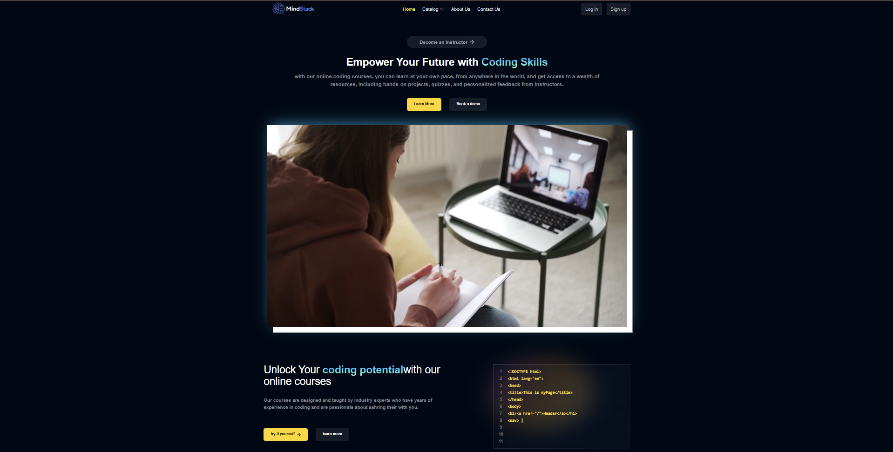
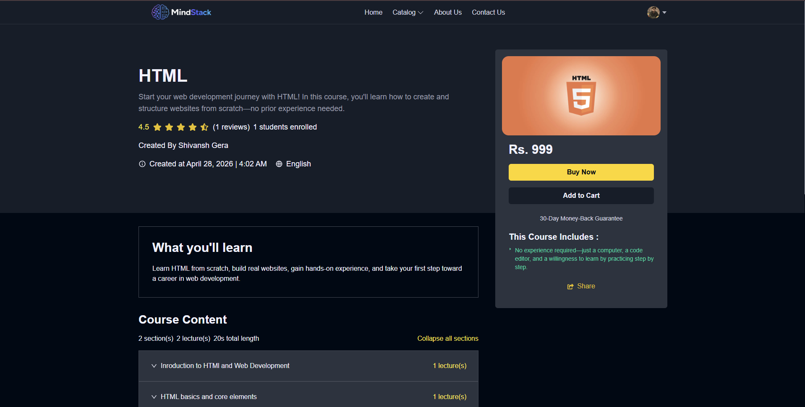
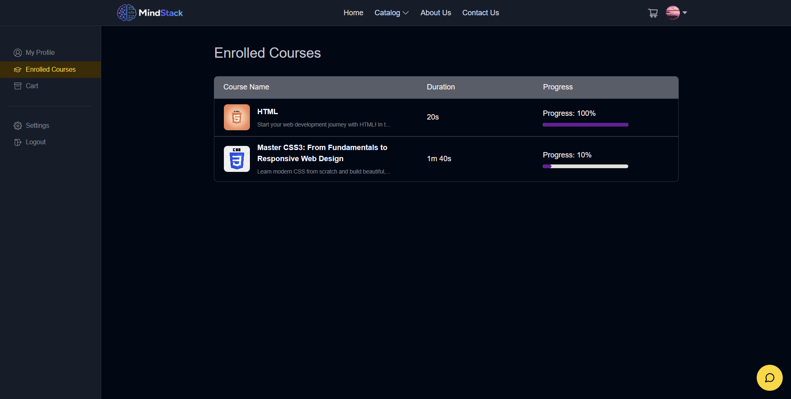
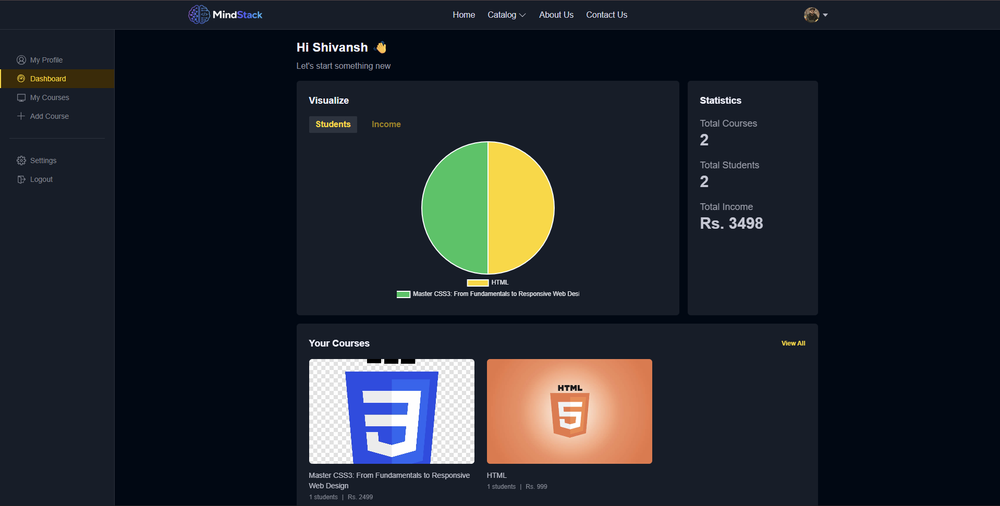

# MindStack


MindStack is a full-stack Learning Management System (LMS) built with the MERN stack. It provides separate student and instructor experiences, allowing instructors to create and manage courses while students can browse, purchase, and learn through an interactive platform with secure authentication and online payments.

---

# 🌐 Live Demo

https://mindstack-lac.vercel.app/

---

# 📖 Project Overview

MindStack is a full-stack EdTech platform designed to simulate a real-world online learning environment. The platform supports complete course management, secure authentication, online payments, media uploads, and role-based dashboards for students and instructors.

The project focuses on building a scalable MERN application using modern development practices including RESTful APIs, JWT authentication, Redux Toolkit for state management, Cloudinary integration, Razorpay payment gateway, and responsive UI development.

---

# ✨ Key Highlights

- 🔐 Secure JWT Authentication with OTP Verification
- 👨‍🏫 Separate Student and Instructor Dashboards
- 💳 Razorpay Payment Gateway Integration
- ☁️ Cloudinary Image & Video Uploads
- 📚 Complete Course Management System
- 📈 Course Progress Tracking
- ⭐ Ratings & Reviews
- 🤖 AI Chatbot Integration
- 📱 Fully Responsive Design

---

# ✨ Features

### Authentication

- User Signup & Login
- OTP Verification
- Forgot Password & Password Reset
- JWT Authentication
- Role-Based Access Control

### Student Features

- Browse Courses
- Search Courses
- View Course Details
- Purchase Courses
- Watch Video Lectures
- Track Course Progress
- Rate & Review Courses
- Manage Profile

### Instructor Features

- Create Courses
- Edit Courses
- Upload Course Thumbnail
- Add Sections
- Upload Video Lectures
- Manage Published Courses
- View Instructor Dashboard

### Platform Features

- Razorpay Payment Integration
- Cloudinary Media Storage
- AI Chatbot
- Contact Form
- Responsive UI
- RESTful API Architecture

---

# 🛠 Tech Stack

| Area | Technologies |
|------|--------------|
| Frontend | React.js, Vite, Tailwind CSS, Redux Toolkit, React Router |
| Backend | Node.js, Express.js |
| Database | MongoDB, Mongoose |
| Authentication | JWT, bcryptjs, OTP Verification |
| Payments | Razorpay |
| Media | Cloudinary, express-fileupload |
| Email | Nodemailer |
| AI | Gemini API / OpenAI API |
| Deployment | Vercel, Render |

---

# 📂 Folder Structure

```text
MindStack/
├── client/
│   ├── src/
│   │   ├── components/
│   │   ├── pages/
│   │   ├── services/
│   │   ├── slices/
│   │   ├── hooks/
│   │   └── utils/
│
├── server/
│   ├── config/
│   ├── controllers/
│   ├── middleware/
│   ├── models/
│   ├── routes/
│   ├── utils/
│   └── mail/
│
├── screenshots/
│
└── README.md
```

---

# ⚙️ Environment Variables

Create `.env` files where required.

## Client

```env
VITE_BASE_URL=http://localhost:4000/api/v1
VITE_RAZORPAY_KEY=your_razorpay_key
```

## Server

```env
PORT=4000

MONGODB_URL=your_mongodb_connection_string

JWT_SECRET=your_jwt_secret

MAIL_HOST=your_mail_host
MAIL_USER=your_mail_user
MAIL_PASS=your_mail_password

CLOUD_NAME=your_cloudinary_cloud_name
API_KEY=your_cloudinary_api_key
API_SECRET=your_cloudinary_api_secret
FOLDER_NAME=your_cloudinary_folder

RAZORPAY_KEY=your_razorpay_key
RAZORPAY_SECRET=your_razorpay_secret

AI_PROVIDER=gemini

GEMINI_API_KEY=your_gemini_api_key
GEMINI_MODEL=gemini-2.5-flash

OPENAI_API_KEY=your_openai_api_key
OPENAI_MODEL=gpt-4.1-mini
```

---

# 🚀 Installation & Setup

Clone the repository

```bash
git clone https://github.com/ShivanshGera/mindstack.git
```

Move into the project directory

```bash
cd MindStack
```

Install dependencies

```bash
npm install

npm install --prefix client

npm install --prefix server
```

---

# ▶️ Running Locally

Run frontend and backend together

```bash
npm run dev
```

Or run them separately

```bash
npm run dev --prefix server

npm run dev --prefix client
```

Frontend

```
http://localhost:5173
```

Backend

```
http://localhost:4000
```

---

# ☁️ Deployment

The application is deployed using a modern full-stack deployment setup.

### Frontend

- Vercel

### Backend

- Render

### Database

- MongoDB Atlas

To deploy the project successfully, configure all required environment variables for both the frontend and backend.

---

# 📸 Application Preview

## 🏠 Home Page

<p align="center">
  
</p>

The landing page introduces the platform with featured courses, categories, and a clean user interface that allows students to explore learning opportunities.

---

## 📖 Course Details

<p align="center">
  
</p>

The course details page provides complete information about a course including the curriculum, instructor, pricing, ratings, and learning outcomes before enrollment.

---

## 👨‍🎓 Student Dashboard

<p align="center">
  
</p>

Students can access their enrolled courses, continue learning, update their profile, and monitor their course progress from a personalized dashboard.

---

## 👨‍🏫 Instructor Dashboard

<p align="center">
  
</p>

The instructor dashboard allows course creators to manage published courses, upload content, monitor performance, and organize learning material efficiently.

---

# 🚀 Future Improvements

Although the platform already supports a complete learning workflow, there are several enhancements that can further improve the overall experience.

- Certificate generation after course completion
- Wishlist functionality
- Advanced course filtering and search
- Course recommendation system
- Live classes using WebRTC
- Discussion forum for students
- Instructor analytics dashboard
- Admin dashboard for platform management
- Course completion badges and achievements
- Unit and integration testing

---

# 👨‍💻 Author

**Shivansh Gera**

Full Stack MERN Developer

- 📧 **Email:** shivanshgera15@gmail.com
- 💼 **LinkedIn:** https://www.linkedin.com/in/shivanshgera
- 💻 **GitHub:** https://github.com/ShivanshGera

If you found this project helpful, consider giving it a ⭐ on GitHub.

---

## License

This project is licensed under the ISC License.

---

### Thank You for Visiting

If you have any suggestions or feedback, feel free to connect with me on LinkedIn or GitHub.